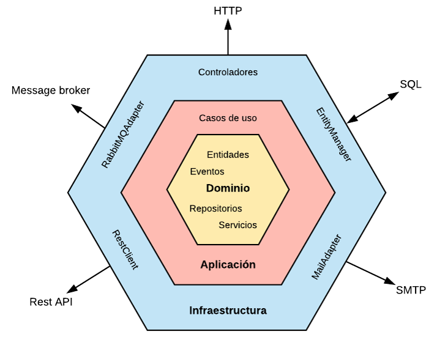

# Sistema Bancario con Quarkus y Arquitectura Hexagonal

Sistema bancario completo implementado con **Quarkus**, **PostgreSQL** y **Arquitectura Hexagonal** que proporciona APIs REST para la gestión de personas, clientes, cuentas y movimientos bancarios.

## 🏗️ Arquitectura Hexagonal

La arquitectura hexagonal (Ports and Adapters) organiza la aplicación separando la lógica de negocio del núcleo de la infraestructura externa. El dominio permanece independiente de frameworks, bases de datos y interfaces externas.



## 🛠️ Stack Tecnológico

### Core
- **Java 21** - Lenguaje principal
- **Quarkus 3.23.3** - Framework supersónico y nativo
- **Maven 3.9.9** - Gestión de dependencias y build
- **PostgreSQL 15** - Base de datos principal

### Dependencias Clave
- **Hibernate ORM Panache** - ORM simplificado
- **RESTEasy Reactive** - Servicios REST reactivos
- **Flyway** - Migraciones de base de datos
- **OpenAPI/Swagger** - Documentación de API
- **MapStruct** - Mapeo de objetos
- **Mockito + JUnit 5** - Testing

### Infraestructura
- **Docker & Docker Compose** - Containerización
- **PgAdmin** - Administración de BD
- **Health Checks** - Monitoreo de salud

## 📁 Estructura del Proyecto

```
src/main/java/com/resolutions/
├── adapters/                    # Adaptadores (Infraestructura)
│   ├── in/                     # Adaptadores de entrada
│   │   └── rest/               # Controllers REST
│   │       ├── dto/            # DTOs para API
│   │       ├── mapper/         # Mappers DTO <-> Entity
│   │       ├── PersonaResource.java
│   │       ├── ClienteResource.java
│   │       ├── CuentaResource.java
│   │       ├── MovimientoResource.java
│   │       └── CatalogoResources.java
│   ├── out/                    # Adaptadores de salida
│   │   ├── persistence/        # Repositorios JPA
│   │   ├── jpa/               # Entidades JPA alternativas
│   │   └── logger/            # Logger personalizado
│   └── QuarkusAppConfig.java   # Configuración de inyección
│
├── application/                # Aplicación (Casos de Uso)
│   ├── ports/                 # Interfaces (Puertos)
│   │   ├── in/                # Puertos de entrada
│   │   │   ├── PersonaUseCase.java
│   │   │   ├── ClienteUseCase.java
│   │   │   ├── CuentaUseCase.java
│   │   │   ├── MovimientoUseCase.java
│   │   │   └── AddCatalogoUseCase.java
│   │   └── out/               # Puertos de salida
│   │       ├── PersonaRepositoryPort.java
│   │       ├── ClienteRepositoryPort.java
│   │       ├── CuentaRepositoryPort.java
│   │       ├── MovimientoRepositoryPort.java
│   │       ├── DataPersist.java
│   │       └── LoggerLocal.java
│   └── useCases/              # Implementación de casos de uso
│       ├── PersonaUseCaseImpl.java
│       ├── ClienteUseCaseImpl.java
│       ├── CuentaUseCaseImpl.java
│       ├── MovimientoUseCaseImpl.java
│       └── AddCatalogo.java
│
├── model/                     # Dominio (Entidades)
│   ├── Persona.java          # Entidad persona
│   ├── Cliente.java          # Entidad cliente (hereda de Persona)
│   ├── Cuenta.java           # Entidad cuenta bancaria
│   ├── Movimiento.java       # Entidad movimiento bancario
│   ├── Catalogo.java         # Entidad catálogo
│   └── ItemCatalogo.java     # Item de catálogo
│
└── utils/                    # Utilidades
    └── DatabaseConnectivityTest.java
```

### Base de Datos
```
src/main/resources/db/migration/
├── V1.0.0__create_schema.sql    # Creación del esquema
├── V1.1.0__init.sql            # Inicialización y permisos
└── V1.2.0__app_schema.sql      # Tablas de aplicación
```

## 🗄️ Modelo de Datos

### Esquema de Base de Datos (`arq_hex`)

```sql
-- Tabla Persona (entidad base)
persona {
  persona_id VARCHAR(10) PK
  nombre VARCHAR(100) NOT NULL
  genero VARCHAR(10)
  edad INTEGER
  direccion VARCHAR(150)
  telefono VARCHAR(20)
}

-- Tabla Cliente (hereda de Persona)
cliente {
  cliente_id SERIAL PK
  persona_id VARCHAR(10) FK UNIQUE
  contrasena VARCHAR(50) NOT NULL
  estado BOOLEAN DEFAULT TRUE
}

-- Tabla Cuenta
cuenta {
  cuenta_id SERIAL PK
  numero_cuenta VARCHAR(20) UNIQUE NOT NULL
  tipo_cuenta VARCHAR(20)
  saldo_inicial NUMERIC(10,2) DEFAULT 0.00
  estado BOOLEAN DEFAULT TRUE
  cliente_id INTEGER FK
}

-- Tabla Movimiento
movimiento {
  movimiento_id SERIAL PK
  fecha DATE DEFAULT CURRENT_DATE
  tipo_movimiento VARCHAR(20) NOT NULL
  valor NUMERIC(10,2) NOT NULL
  saldo NUMERIC(10,2) NOT NULL
  cuenta_id INTEGER FK
}

-- Tablas de Catálogo (sistema auxiliar)
gencatsenca { codcat, catdesc, codusr, fechcrea, fechmod }
gencatsdeta { codcat, codcor, cordesc, codusr, fechcrea, fechmod }
```

## 🚀 Guía de Instalación y Ejecución

### Prerrequisitos
- **Java 21** o superior
- **Maven 3.8+**
- **Docker** y **Docker Compose**
- **Git**

### 1. Clonar el Repositorio
```bash
git clone https://github.com/cecyksw-ui/PryQuarkus.git
cd PryQuarkus
```

### 2. Configuración de Base de Datos

#### Opción A: Docker Compose (Recomendado)
```bash
# Levantar PostgreSQL y la aplicación
docker-compose up -d

# Ver logs
docker-compose logs -f quarkus-app
```

#### Opción B: PostgreSQL Local
```bash
# Crear base de datos
createdb -U postgres prueba

# Verificar conexión
psql -U postgres -d prueba -f verify_db.sql
```

### 3. Ejecutar en Modo Desarrollo

#### Modo Dev (Hot Reload)
```bash
# Windows
.\mvnw.cmd quarkus:dev

# Linux/Mac
./mvnw quarkus:dev
```

#### Compilar y Ejecutar
```bash
# Compilar
./mvnw clean package

# Ejecutar JAR
java -jar target/quarkus-app/quarkus-run.jar
```

### 4. Verificar Instalación

#### Health Checks
```bash
# Estado de la aplicación
curl http://localhost:8081/q/health

# Estado detallado
curl http://localhost:8081/q/health/live
curl http://localhost:8081/q/health/ready
```

#### Documentación de API
- **Swagger UI**: http://localhost:8081/q/swagger-ui
- **OpenAPI Spec**: http://localhost:8081/q/openapi

## 🧪 Testing y Pruebas

### Ejecutar Tests Unitarios
```bash
# Todos los tests
./mvnw test

# Tests específicos
./mvnw test -Dtest=PersonaUseCaseImplTest
./mvnw test -Dtest=ClienteUseCaseImplTest

# Tests con cobertura
./mvnw test jacoco:report
```

### Tests de Integración
```bash
# Tests de integración
./mvnw verify

# Tests con perfil de integración
./mvnw test -Pintegration-tests
```

### Ejemplos de API Testing

#### Crear Persona
```bash
curl -X POST http://localhost:8081/api/personas \
  -H "Content-Type: application/json" \
  -d '{
    "personaId": "PER001",
    "nombre": "Juan Pérez",
    "genero": "M",
    "edad": 30,
    "direccion": "Calle 123, Ciudad",
    "telefono": "555-1234"
  }'
```

#### Crear Cliente
```bash
curl -X POST http://localhost:8081/api/clientes \
  -H "Content-Type: application/json" \
  -d '{
    "personaId": "PER001",
    "contrasena": "password123",
    "estado": true
  }'
```

#### Crear Cuenta
```bash
curl -X POST http://localhost:8081/api/cuentas \
  -H "Content-Type: application/json" \
  -d '{
    "numeroCuenta": "1001",
    "tipoCuenta": "AHORROS",
    "saldoInicial": 1000.00,
    "clienteId": 1
  }'
```

#### Crear Movimiento
```bash
curl -X POST http://localhost:8081/api/movimientos \
  -H "Content-Type: application/json" \
  -d '{
    "tipoMovimiento": "DEPOSITO",
    "valor": 500.00,
    "saldo": 1500.00,
    "cuentaId": 1
  }'
```

#### Consultar Datos
```bash
# Obtener todas las personas
curl http://localhost:8081/api/personas

# Obtener persona por ID
curl http://localhost:8081/api/personas/PER001

# Obtener clientes activos
curl http://localhost:8081/api/clientes?estado=true

# Obtener cuentas por cliente
curl http://localhost:8081/api/cuentas?clienteId=1

# Obtener movimientos por cuenta
curl http://localhost:8081/api/movimientos?cuentaId=1
```

## 🗃️ Gestión de Base de Datos

### Migraciones con Flyway

#### Ejecutar migraciones manualmente
```bash
# Información de migración
./mvnw flyway:info

# Ejecutar migraciones pendientes
./mvnw flyway:migrate

# Limpiar base de datos (¡CUIDADO!)
./mvnw flyway:clean

# Reparar historial de migraciones
./mvnw flyway:repair

# Validar migraciones aplicadas
./mvnw flyway:validate
```

#### Crear nueva migración
```bash
# Crear archivo de migración
# Formato: V{version}__{description}.sql
# Ejemplo: src/main/resources/db/migration/V1.3.0__add_new_table.sql
```

### Limpieza y Reset de BD
```bash
# Limpiar y recrear esquema
./mvnw flyway:clean flyway:migrate

# Script de verificación
psql -U postgres -d prueba -f verify_db.sql

# Test de conectividad desde Java
./mvnw exec:java -Dexec.mainClass="com.resolutions.utils.DatabaseConnectivityTest"
```

### Backup y Restore
```bash
# Backup
pg_dump -U postgres -d prueba > backup_$(date +%Y%m%d_%H%M%S).sql

# Restore
psql -U postgres -d prueba < backup_file.sql

# Backup solo esquema arq_hex
pg_dump -U postgres -d prueba -n arq_hex > backup_arq_hex.sql
```

## 🐳 Docker y Despliegue

### Construcción de Imágenes

#### Imagen JVM (Recomendado)
```bash
# Construir aplicación
./mvnw clean package

# Construir imagen Docker
docker build -t quarkus/banking-app:jvm .

# Ejecutar contenedor
docker run -p 8080:8080 quarkus/banking-app:jvm
```

#### Imagen Nativa (Óptimo rendimiento)
```bash
# Compilar nativo (requiere GraalVM)
./mvnw clean package -Dnative -Dquarkus.native.container-build=true

# Construir imagen nativa
docker build -f src/main/docker/Dockerfile.native -t quarkus/banking-app:native .

# Ejecutar imagen nativa
docker run -p 8080:8080 quarkus/banking-app:native
```

### Docker Compose Avanzado

#### Desarrollo
```bash
# Levantar solo PostgreSQL para desarrollo local
docker-compose up -d postgres pgadmin

# Conectar a PgAdmin: http://localhost:5050
# Email: admin@example.com, Password: admin123
```

#### Producción
```bash
# Construir y levantar todo el stack
docker-compose up --build -d

# Escalar aplicación
docker-compose up --scale quarkus-app=3

# Ver logs en tiempo real
docker-compose logs -f

# Detener servicios
docker-compose down

# Limpiar volúmenes (¡CUIDADO!)
docker-compose down -v
```

### Verificación de Docker
```powershell
# Windows PowerShell - Ejecutar script de verificación
.\verify-docker.ps1
```

## 📊 Monitoreo y Observabilidad

### Health Checks
```bash
# Estado general
curl http://localhost:8081/q/health

# Estado de base de datos
curl http://localhost:8081/q/health/ready

# Métricas de aplicación
curl http://localhost:8081/q/metrics
```

### Logs
```bash
# Ver logs de aplicación
docker-compose logs quarkus-app

# Logs en tiempo real
docker-compose logs -f quarkus-app

# Logs de PostgreSQL
docker-compose logs postgres
```

### Debugging
```bash
# Modo debug (puerto 5005)
./mvnw quarkus:dev -Ddebug=5005

# Debug con Docker
docker run -p 8080:8080 -p 5005:5005 -e JAVA_DEBUG=true quarkus/banking-app:jvm
```

## 🔧 Configuración Avanzada

### Perfiles de Configuración

#### Desarrollo (`application.properties`)
```properties
# Puerto de desarrollo
quarkus.http.port=8081

# Base de datos local
quarkus.datasource.jdbc.url=jdbc:postgresql://localhost:5432/prueba

# Logs detallados
quarkus.log.category."com.resolutions".level=DEBUG
quarkus.hibernate-orm.log.sql=true
```

#### Producción
```properties
# Configurar variables de entorno en producción
QUARKUS_HTTP_PORT=8080
QUARKUS_DATASOURCE_JDBC_URL=jdbc:postgresql://prod-db:5432/banking
QUARKUS_LOG_LEVEL=WARN
```

### Variables de Entorno para Docker
```bash
# Archivo .env
POSTGRES_DB=prueba
POSTGRES_USER=postgres
POSTGRES_PASSWORD=postgres
QUARKUS_HTTP_PORT=8080
```

## 📝 Características del Sistema

### Funcionalidades Principales

- ✅ **Gestión de Clientes** - Herencia de personas con autenticación
- ✅ **Gestión de Cuentas** - Múltiples cuentas por cliente
- ✅ **Movimientos ** - Depósitos, retiros, transferencias
- ✅ **API REST Completa** - Endpoints documentados con OpenAPI
- ✅ **Validaciones de Negocio** - Reglas bancarias aplicadas
- ✅ **Arquitectura Hexagonal** - Separación clara de responsabilidades

### Características Técnicas
- 🚀 **Alto Rendimiento** - Quarkus supersónico
- 🔒 **Transacciones ACID** - Consistencia de datos garantizada
- 📊 **Migraciones Automáticas** - Flyway integrado
- 🐳 **Containerizado** - Docker ready
- 🧪 **Testing Completo** - Unitarios e integración
- 📖 **Documentación Auto** - Swagger/OpenAPI
- 🔍 **Observabilidad** - Health checks y métricas
- ⚡ **Hot Reload** - Desarrollo rápido

## 🤝 Contribución

### Estructura de Commits
```bash
git commit -m "feat: agregar endpoint para transferencias"
git commit -m "fix: validación de saldo insuficiente"
git commit -m "docs: actualizar documentación de API"
```

### Pull Requests
1. Fork del proyecto
2. Crear feature branch (`git checkout -b feature/nueva-funcionalidad`)
3. Commit de cambios (`git commit -am 'feat: nueva funcionalidad'`)
4. Push branch (`git push origin feature/nueva-funcionalidad`)
5. Crear Pull Request


### Problemas Comunes

#### Error de conexión a PostgreSQL
```bash
# Verificar que PostgreSQL esté corriendo
docker-compose ps postgres

# Revisar logs de PostgreSQL
docker-compose logs postgres

# Probar conexión directa
psql -h localhost -p 5432 -U postgres -d prueba
```

#### Puerto ocupado
```bash
# Cambiar puerto en application.properties
quarkus.http.port=8082

# O usar variable de entorno
export QUARKUS_HTTP_PORT=8082
```

#### Problemas con Flyway
```bash
# Reparar migraciones
./mvnw flyway:repair

# Ver estado
./mvnw flyway:info

# Limpiar y recrear (¡CUIDADO!)
./mvnw flyway:clean flyway:migrate
```

#### Memoria insuficiente
```bash
# Aumentar memoria para Maven
export MAVEN_OPTS="-Xmx2g"

# Para Docker
docker run -m 2g quarkus/banking-app:jvm
```

---

> **Nota**: Este proyecto es una demostración de arquitectura hexagonal con Quarkus. Ideal para aprendizaje y como base para sistemas bancarios o financieros más complejos.
